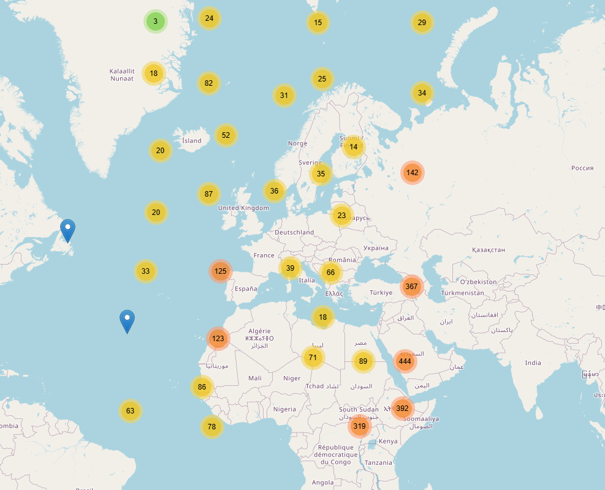
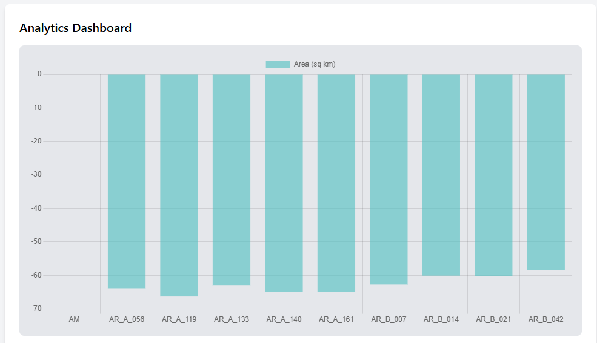

# Disease Hotspot Tracker 🗺️  
An interactive web application to track and analyze disease hotspots in real-time. Built for public health professionals, this tool leverages geospatial data and clustering algorithms to provide actionable insights.  

## 🚀 Features  
- Interactive maps with clustering (Leaflet.js).  
- Spatiotemporal analytics for hotspot trends.  
- Real-time alerts for outbreak monitoring.  
- PostgreSQL/PostGIS-powered geospatial queries.  

## 📂 Project Structure  

## 🖥️ Tech Stack  
- **Frontend**: React.js, Leaflet.js  
- **Backend**: Node.js, Express.js  
- **Database**: PostgreSQL with PostGIS  
- **Clustering**: Fuzzy C-Means, DBSCAN  

## 📊 Data Sources
- Google Health COVID-19 Open Data
- Public health datasets and synthetic test data.

  

